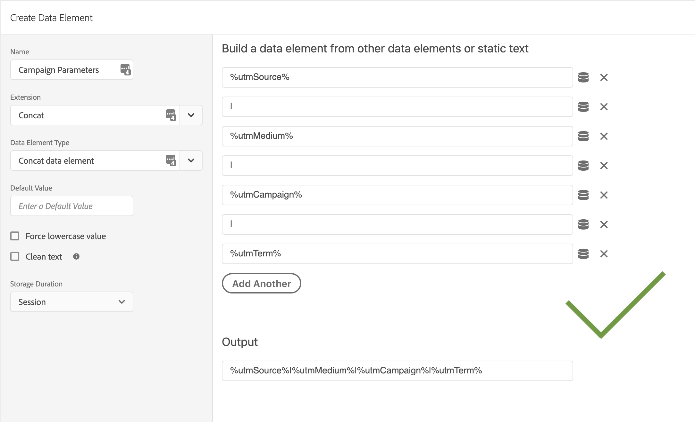

# Concat Extension for Adobe Launch
## Create new data elements by concatenating existing data elements and/or static text

Use the Concat Launch extension to make new data elements by concatenating existing data elements. You can
also combine data elements with static text, useful for pipe delimited evars and props. Build your Concat Data Element
by installing the extension and selecting "Concat Data Element" under type in the data element creator. 

### Turn this

### Into this

### Concat Data Element Output
``https://www.example.com?utm_campaign=abc&utm_source=xyz&utm_campaign=123&utm_source=777``

